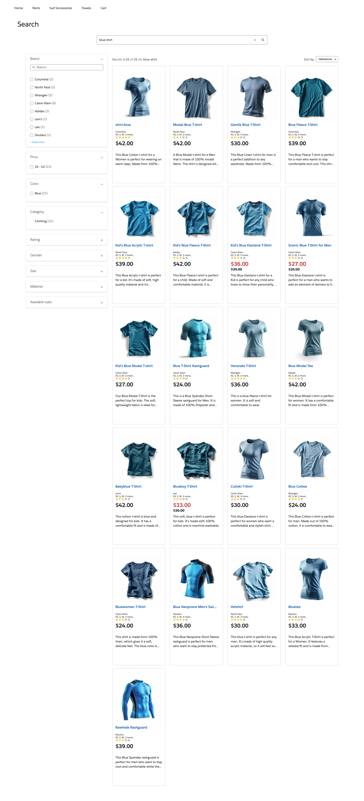

# Coveo LWC Commerce Library

A collection of Coveo Commerce easy-to-digest code examples for Lightning Web Components on Salesforce Platform

## Examples

Commerce Examples Community : `https://jfallaire-dev-ed.my.site.com/`

### Home Page with Recommendations


### Product Search Page 



### Search Box with Instant Product 


### Listing Page


### Cart Page


## Using the Library

This library is released as an [unlocked package](https://developer.salesforce.com/docs/atlas.en-us.sfdx_dev.meta/sfdx_dev/sfdx_dev_unlocked_pkg_install_pkg.htm). You can install it using the following links:

* [Install coveo-lwc-commerce-recipes in a production environment](https://login.salesforce.com/packaging/installPackage.apexp?p0=04tKi0000004f0qIAA).

* [Install coveo-lwc-commerce-recipes in a sandbox environment](https://test.salesforce.com/packaging/installPackage.apexp?p0=04tKi0000004f0qIAA).

You can also install coveo-lwc-commerce-recipes with the Salesforce CLI package install command:

```
sf package install --package 04tKi0000004f0qIAA --target-org <USER_NAME>
```

where you replace `<USER_NAME>` with your username in the target Salesforce organization.

> Note: 
> You should always keep your Apex code clean and compiled. However, if you only want to compile the package Apex code during the installation, use the --apex-compile package option.
>```
> sf package install --apex-compile package --package 04tKi0000004f0qIAA --target-org <USER_NAME>
> ```


## Contributing

### Create a Salesforce Developer Organization

- [Sign up](https://developer.salesforce.com/signup)
- Use your @coveo.com email account. The username can be anything.

### Setup SFDX CLI

[Salesforce cli](https://developer.salesforce.com/docs/atlas.en-us.sfdx_setup.meta/sfdx_setup/sfdx_setup_install_cli.htm#sfdx_setup_install_cli_npm)

- Run `npm install --global @salesforce/cli@2.x`
- Optional: [Setup CLI autocomplete](https://developer.salesforce.com/docs/atlas.en-us.sfdx_setup.meta/sfdx_setup/sfdx_dev_cli_autocomplete.htm)

### Update SFDX CLI Plugins

- Run `sf plugins update`

### Install VSCode Extension

Optionally install the [VSCode Salesforce Extension Pack](https://marketplace.visualstudio.com/items?itemName=salesforce.salesforcedx-vscode) if you do not want use the equivalent `Salesforce cli` commands to setup.

### Enable Dev Hub in Your Salesforce Organization

- Connect to your salesforce developer organization [login](http://login.salesforce.com/)
- From Setup, enter Dev Hub in the Quick Find box and select Dev Hub.
- To enable Dev Hub, click Enable

### Authorize Your Dev Hub

- In VS Code, press Command + Shift P, enter sfdx, and select SFDX: Authorize a Dev Hub.
- You can also run this command from the command line. `sf org login web --set-default-dev-hub --alias LWC-Hub`
- Running this command opens a browser to the Salesforce login page. Enter your Salesforce username and password. Authorize only once, not every time you work on your project.

### Single command run

- Run `npm run scratch:dev`.
- You should now have a scratch org with Commerce components and the test community deployed. Watch your commandline for the url to the examples community.

Or you can run the individual commands below.

#### Create a Default Scratch Org

- Run this command to create the default scratch org. `npm run scratch:create`.
- In VS Code, press Command + Shift P, enter sfdx, and select SFDX: Create a Default Scratch Org.
- You can also run this command from the command line. `sf org create scratch --set-default --definition-file config/lws-enabled-scratch-def.json --alias Commerce__LWS_enabled`
- `Commerce__LWS_enabled` is an alias for the scratch org that you can use in other Salesforce CLI commands. You can create any alias that you like.

#### Deploy the code

- Run this command from the command line. `sf project deploy start --source-dir force-app/main`.

## Use Components Library From Source

After you have cloned the repository and have run `npm install`, run the following commands:

- `npm run build`
- `sf project deploy start --source-dir force-app/main/default`

## Other Useful Commands

- `sf project deploy start --metadata LightningComponentBundle`
- `--metadata LightningComponentBundle` can be changed for different types of "resources". To know which name, check the related `meta.xml` file for each type of resource.
- Create new web components. In VS Code, press Command + Shift P, enter sfdx, and select SFDX: Create Lightning Web Component.

## Read All About It

- [Salesforce Extensions Documentation](https://developer.salesforce.com/tools/vscode/)
- [Salesforce CLI Setup Guide](https://developer.salesforce.com/docs/atlas.en-us.sfdx_setup.meta/sfdx_setup/sfdx_setup_intro.htm)
- [Salesforce DX Developer Guide](https://developer.salesforce.com/docs/atlas.en-us.sfdx_dev.meta/sfdx_dev/sfdx_dev_intro.htm)
- [Salesforce CLI Command Reference](https://developer.salesforce.com/docs/atlas.en-us.sfdx_cli_reference.meta/sfdx_cli_reference/cli_reference.htm)
- [lwc.dev](https://lwc.dev/)
- [Components reference](https://developer.salesforce.com/docs/component-library/overview/components). Make sure you stay in the "Lightning web components section". Aura does not apply. Aura is the older UI library that is being deprecated by Salesforce.
- [Lightning design system](https://www.lightningdesignsystem.com/). Reference for styling, CSS utilities, icons, and more.


## Encountered Issues

- Community Navigation Menu not visible for guest users 
https://salesforce.stackexchange.com/questions/330014/community-navigation-menu-item-not-present-for-guest-users
https://help.salesforce.com/s/articleView?id=experience.rss_tile_menu.htm&type=5

```
You must add 'read' permission on the 'Documents' object for the guest user profile associated with the site in order for tile menus to display for guest users.

The fix I discovered elsewhere suggests that because tile menus can (or used to) use document pictures, this setting is required.

I just ran into this again today when attempting to use a tile menu to display a menu within a new Experience (LWR) site and was stumped. In my testing even opening all the permissions for navigation items, the tile menus (and only tile menus) would not display to unauthenticated guest users until this permission was opened up.
```


